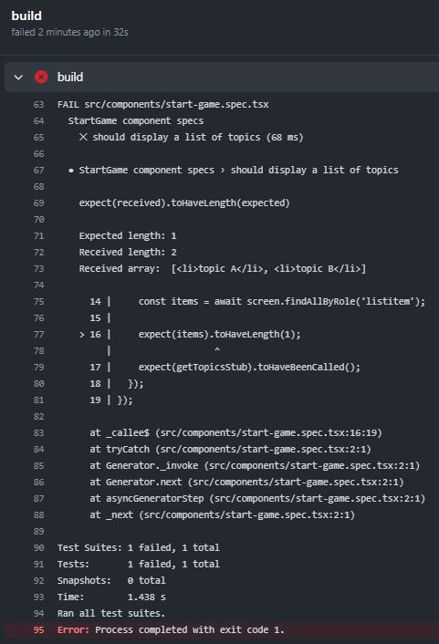
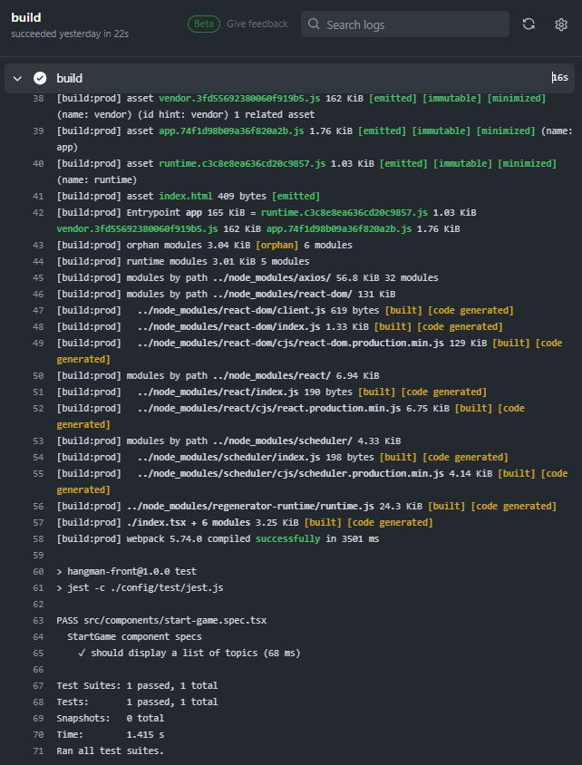

# Exercise 1. CI pipeline with GitHub Actions - MUST
1. [Workflow for automating the build and unit tests](#workflow)
2. [Run the workflow](#run)

<a name="workflow"></a>
## 1. Workflow for automating the build and unit tests

Below is the `.github\workflows\1.ci-hangman-front.yaml` workflow.

```yaml
name: Exercise 1 - npm build and test

on:   
  pull_request:
    paths: ["hangman-front/**"]

jobs:
  build:
    runs-on: ubuntu-latest
   
    steps:
      - uses: actions/checkout@v4
      - uses: actions/setup-node@v4
        with:
          node-version: 16
      - name: build
        working-directory: ./hangman-front
        run: |
          npm ci
          npm run build --if-present
          npm test
```

The above workflow specifies two conditions to run:
* Changes on `hangman-front/**` path 
* Pull request 

It has one job named `build` and it does use the following actions:

* [checkout](https://github.com/actions/checkout) action will perform a local git clone of the repository.
* [setup-node](https://github.com/actions/setup-node) action will take care of installing Node.js inside the container running our job. We can see one of the action arguments here too. The with block tells Actions what Node.js version to install—in our case, the 16 version.
* The next step installs any Node.js modules we need. Then builds it. And then executes our tests using `npm test`.


<a name="run"></a>
## 2. Run the workflow

Follow these steps to run the CI workflow:
1. Create a new branch, e.g. 'ci-newworkflow' and switched to it.
    ```bash
    $ git checkout -b ci-newworkflow
    ```

2. Make a change to our `hangman-front` project, e.g. edit the app.tsx file and add a comment, commit the result, and push it.

    ```bash
    git add hangman-front/src/app.tsx
    git commit -m 'Added a comment to trigger ci workflow'
    git push origin ci-newworkflow
    ```

3. Create a pull request for this branch. After the request has been created, Actions will initiate our workflow, resulting in a failure run. The reason is because the `StartGame` unit test located on `hangman-front/src/components/start-game.spec.tsx` file, has an error. 

   GitHub Action runs displayed on the Actions tab 

   

   And logs within each step

   

   

4. Fix the unit test, and push it, resulting in a successful run.
   Before the fix
   ``` 
   expect(items).toHaveLength(1);
   ```
   After the fix
   ```
   expect(items).toHaveLength(2);
   ```
   

   

5. Merge it to the main branch.