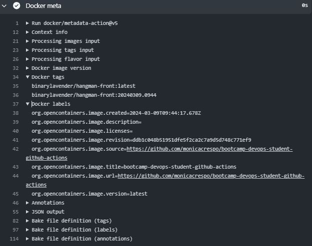
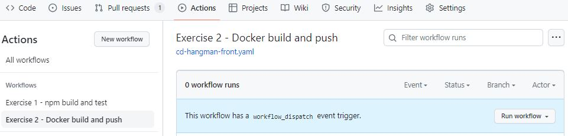
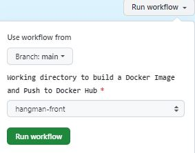

# Exercise 2. CD pipeline with GitHub Actions - MUST 
1. [Workflow for building Docker images](#workflow)
2. [Run the workflow](#run)

<a name="workflow"></a>
## 1. Workflow for building Docker images

Below is the `.github\workflows\2.cd-hangman-front.yaml` workflow.

In summary, this workflow first set the CURRENT_DATE env variable, then, it checks out the GitHub repository, uses the login-action twice to log in to both registries and generates tags and labels with the metadata-action action, with the CURRENT_DATE date tag. Then the build-push-action action builds and pushes the Docker image to Docker Hub and the Container registry.

### workflow_dispatch

```yaml
name: Exercise 2 - Docker build and push

on:
  workflow_dispatch:
    inputs:
      working-directory:
        description: 'Working directory to build a Docker Image'
        default: 'hangman-front'
        type: choice
        required: true
        options:
          - 'hangman-front'
          - 'hangman-api'
```
The `workflow_dispatch` event allows you to manually trigger a GitHub Action, without having to push or create a pull request.

### Control permissions for GITHUB_TOKEN

```yaml
jobs:
  build_and_push_to_registries:
    name: Build and push Docker image to multiple registries
    runs-on: ubuntu-latest
    permissions:
      packages: write
      contents: read
```

Set the permissions granted to the GITHUB_TOKEN for the actions in this job.

* `packages: write` allows the job to ppload and publish packages to GitHub Packages.
* `contents: read` is sufficient for any workflows that simply need to clone and build.

The GITHUB_TOKEN is an automatically generated secret that lets you make authenticated calls to the GitHub API in your workflow runs. Actions generates a new token for each job and expires the token when a job completes.

### Environment Variable

```yaml
    steps:
      - name: Set date tag
        run: |
          echo "CURRENT_DATE=$(date +'%Y%m%d-%H%M')" >> $GITHUB_ENV

      - name: Check out the repo
        uses: actions/checkout@v4
```

This step sets the CURRENT_DATE environment variable using the `%Y%m%d-%H%M` format (e.g. `20240308-2213` for `08/03/2024 22:13`), stores it in the GITHUB_ENV, and automatically makes it available to all subsequent actions in the current job. The currently running action cannot access the updated env variable. 
  
NOTE that `$(command)` is POSIX shell syntax for "run command and substitute its output". `date` is a standard Linux/Unix command, the +FORMAT syntax tells it in which format it should output the date. See also: [date manpage](https://manpages.debian.org/bullseye/coreutils/date.1.en.html).

### Set up Docker Buildx action

```yaml
- name: Set up Docker Buildx
  uses: docker/setup-buildx-action@v3
```
This step uses the [setup-buildx](https://github.com/docker/setup-buildx-action) GitHub Action to create and boot a builder using by default the docker-container driver. This is not required but recommended using it to be able to build multi-platform images, export cache, etc.

### Log in to Docker Hub action 
```yaml
- name: Login to Docker Hub
  uses: docker/login-action@v3
  with:
    username: ${{ secrets.DOCKER_USER }}
    password: ${{ secrets.DOCKER_PASSWORD }}
 ```
This step uses the [docker/login-action](https://github.com/docker/login-action) action to log in against the Docker registry.
We are using the `DOCKER_USER` and `DOCKER_PASSWORD` as `secrets` to provide credentials to log in to the DockerHub registry we want to store our Docker image. Both values are encrypted and open decrypted when being used during our workflow’s execution, so they are not exposed in the workflow file.

### Log in to the Container registry 

```yaml
- name: Log in to the Container registry
  uses: docker/login-action@v3
  with:
    registry: ghcr.io
    username: ${{ github.actor }}
    password: ${{ secrets.GITHUB_TOKEN }}
```
This step uses the docker/login-action action to log in to the Container registry using the account and password that will publish the packages. Once published, the packages are scoped to the account defined here.

### Docker Metadata action

```yaml
- name: Extract metadata (tags, labels) for Docker
  id: meta
  uses: docker/metadata-action@v5
  with:
    # list of Docker images to use as base name for tags
    images: |
      ${{ secrets.DOCKER_USER }}/${{ inputs.working-directory }}
      ghcr.io/${{ github.repository_owner }}/${{ inputs.working-directory }}
    # generate Docker tags based on the following events/attributes
    tags: |
      type=raw,value=latest,enable={{is_default_branch}} 
      type=raw,value=${{ env.CURRENT_DATE }}
```

This step uses [docker/metadata-action@v5](https://github.com/docker/metadata-action) to extract tags and labels that will be applied to the specified image. The id "meta" allows the output of this step to be referenced in a subsequent step. The images value provides the base name for the tags and labels.

On the default branch, in this repository is `main`, the action will generate the following two tags: 
* `latest` by using
  * [custom tag type=raw](https://github.com/docker/metadata-action?tab=readme-ov-file#typeraw)
  * [{{is_default_branch}}](https://github.com/docker/metadata-action?tab=readme-ov-file#is_default_branch) returns true if the branch that triggered the workflow run is the default one, otherwise false.
* date, e.g. `20240308-2213` by using
  * [custom tag type=raw](https://github.com/docker/metadata-action?tab=readme-ov-file#typeraw)
  * CURRENT_DATE set up in the previous `Get current date` action.

Any other branches, it will generate only one tag with the current date.




### Build and push Docker Image

```yaml
- name: Build and push Docker Images
  uses: docker/build-push-action@v5
  with:
    push: true
    context: ./${{ inputs.working-directory }}
    file: ./${{ inputs.working-directory }}/Dockerfile
    tags: ${{ steps.meta.outputs.tags }}
    labels: ${{ steps.meta.outputs.labels }}
  ```

This step uses the [build-push](https://github.com/docker/build-push-action) action to build the image, based on your repository's Dockerfile. If the build succeeds, it pushes the image to GitHub Packages and Docker official Container registry (Docker Hub). It uses the context parameter to define the build's context as the set of files located in the specified path. It uses the tags and labels parameters to tag and label the image with the output from the "meta" step.

The build-push-action main options required for GitHub Packages are:
  * context: Defines the build's context as the set of files located in the specified path.
  * push: If set to true, the image will be pushed to the registry if it is built successfully.
  * tags generated in the "Docker meta" action, for example, `binarylavender/hangman-front:latest,binarylavender/hangman-front:20240309.0944`.

<a name="run"></a>
## 2. Run the workflow

To run you workflow follow these steps:
1. Add the DOCKER_PASSWORD secret's value in our repository settings. For more information, see [Creating secrets for a repository](https://docs.github.com/en/actions/security-guides/using-secrets-in-github-actions#creating-secrets-for-a-repository).

2. Go to the Actions tab of your repository, click on the "Exercise 2 - Docker build and push" workflow, and then "Run workflow" button:

    

    