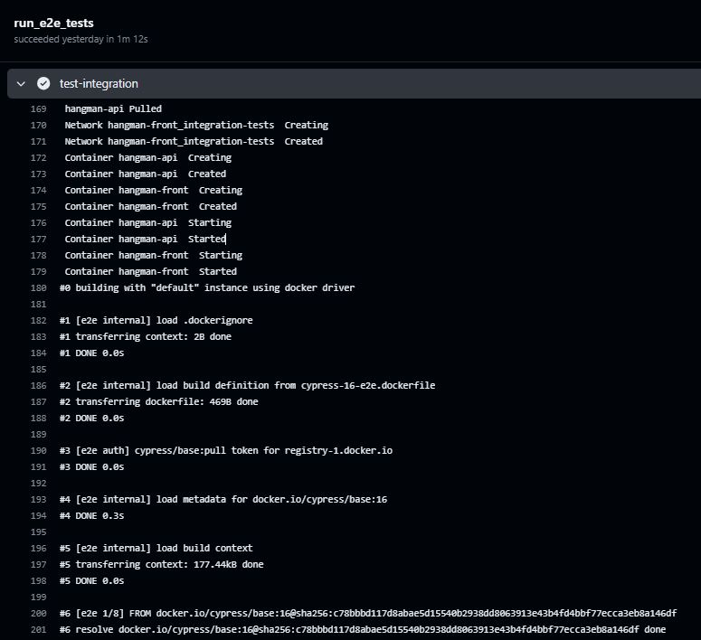
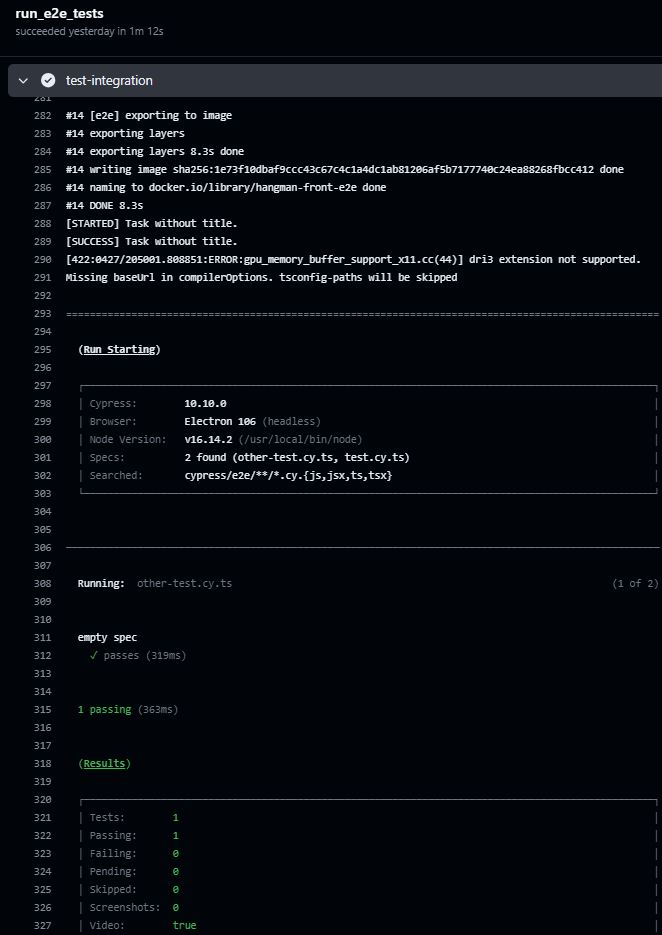

# Exercise 4. Running Cypress in CI with Health Check in Docker Compose - CHALLENGE
0. [Introduction](#intro)
1. [Dockerfile with Cypress](#dockerfile)
2. [Docker Compose to run in CI/CD Pipeline](#dockercompose)
3. [Workflow for running e2e tests using Docker Compose](#workflow)
4. [Run the workflow](#run)

<a name="intro"></a>
## 0. Introduction

To make sure that the execution of the Cypress test runner needs to fire after the web `hangman-front` service connects and run its server, we are using a health check within the Docker Compose file.

To achieve this, these are the steps I've followed:

1. Create a `hangman-e2e\e2e\cypress-16-e2e.dockerfile` Dockerfile for Cypress Tests

2. Create a `hangman-front\docker-compose-health-check.yml` Docker Compose file to run in CI/CD Pipeline

3. Create the `.github\workflows\4.e2e-hangman-front-docker-compose-health-check.yaml` GitHub workflow

4. Run the workflow

<a name="dockerfile"></a>
## 2. Dockerfile with Cypress

```Dockerfile
# Use the Cypress base image
FROM cypress/base:16

# Set the working directory in the container
WORKDIR /app

# Copy the test code into the container
COPY ./package.json .
COPY ./package-lock.json .
COPY ./cypress.config.ts .
COPY ./tsconfig.json .
COPY ./cypress ./cypress

ENV CI=1 

# Install Cypress and any other required npm packages
RUN npm ci

# Execute the Cypress test runner
CMD ["npx", "cypress", "run"]
```

In the above Dockerfile we set a Cypress base image, specify the working directory, copy our project files into the container, install dependencies, and set the default command to run our tests.

<a name="dockercompose"></a>
## 2. Docker Compose to run in CI/CD Pipeline

When integrating into CI/CD pipelines, we can make use of Docker Compose to control multiple containers.

Below is the `hangman-front\docker-compose-health-check.yml` for this full-stack hangman application with Cypress tests. 

```yml
version: '3.9'

networks:
  integration-tests:
    driver: bridge

services:
  hangman-front:
    image: binarylavender/hangman-front:latest
    container_name: hangman-front
    depends_on:
      - hangman-api
    ports:
      - "8080:8080"
    environment:
      API_URL: http://localhost:3001
    healthcheck:
      test: ["CMD", "curl", "-f", "http://localhost:8080/ping"]
      interval: 2s
      timeout: 60s
      retries: 20
    networks:
      - integration-tests

  hangman-api:
      image: binarylavender/hangman-api:latest
      container_name: hangman-api
      ports:
        - "3001:3000"      
      networks:
        - integration-tests

  e2e:
    container_name: cypress
    depends_on:
      hangman-front:
        condition: service_healthy
    build:
      context: ../hangman-e2e/e2e
      dockerfile: cypress-16-e2e.dockerfile
    environment:
      - CYPRESS_BASE_URL=http://hangman-front:8080      
    # command: npx cypress run   
    networks:
      - integration-tests
```

The above example has tree services: `hangman-api`, `hangman-front` and `e2e` services. The `e2e` service specifies that it depends on the `hangman-front` service. The additional condition on the depends on is the dependent service and has to be healthy with service_healthy. This makes sure that the `e2e` service starts only after the `hangman-front` service is healthy (able to receive connections).
```
 e2e:
    container_name: cypress
    depends_on:
      hangman-front:
        condition: service_healthy
```

There are other options for health check like interval, timeout, and retires. For this example, you are specifying a retry of a maximum of 20 times every 2-second interval with a timeout of 60 seconds. All this has been highlighted in the below  code snippet.

```
  hangman-front:
    ...
    healthcheck:
      test: ["CMD", "curl", "-f", "http://localhost:8080/ping"]
      interval: 2s
      timeout: 60s
      retries: 20
```

<a name="workflow"></a>
## 3. Workflow for running e2e tests using Docker Compose

Below is the `4.e2e-hangman-front-docker-compose-health-check.yaml` workflow.

```yml
name: Exercise 4 - Run e2e tests using Docker Compose with Health Check

on:
  workflow_dispatch:

jobs:
  run_e2e_tests:
    runs-on: ubuntu-latest

    steps:
      - name: Checkout the repo
        uses: actions/checkout@v4
      - name: Login to Docker Hub
        uses: docker/login-action@v3
        with:
          username: ${{ secrets.DOCKER_USER }}
          password: ${{ secrets.DOCKER_PASSWORD }}
      - name: test-integration
        working-directory: ./hangman-front
        run: |
          docker compose -f docker-compose-health-check.yml run e2e
```
With the -f flag we specify the name of the `hangman-front\docker-compose-health-check.yml` Compose file.

To set the path of the Compose file, we use `working-directory` on the step

<a name="run"></a>
## 4. Run the workflow

Run manually the `Exercise 4 - Run e2e tests using Docker Compose with Health Check`.




