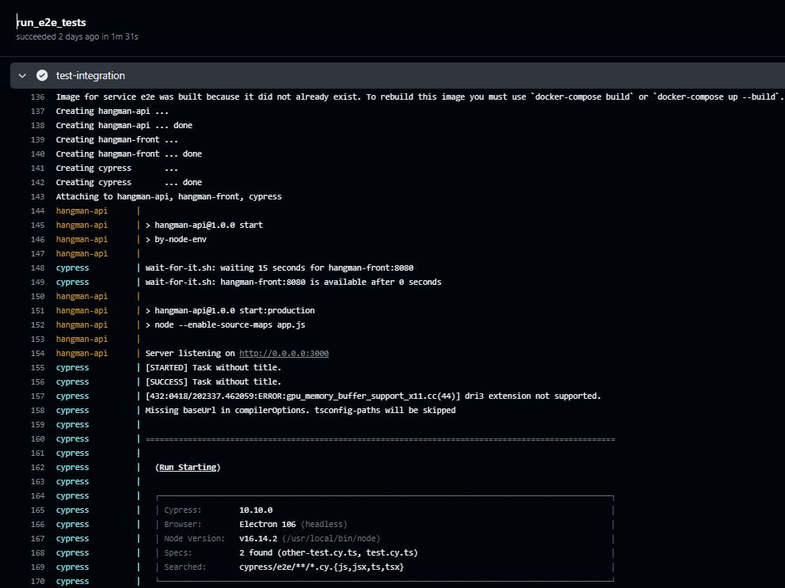
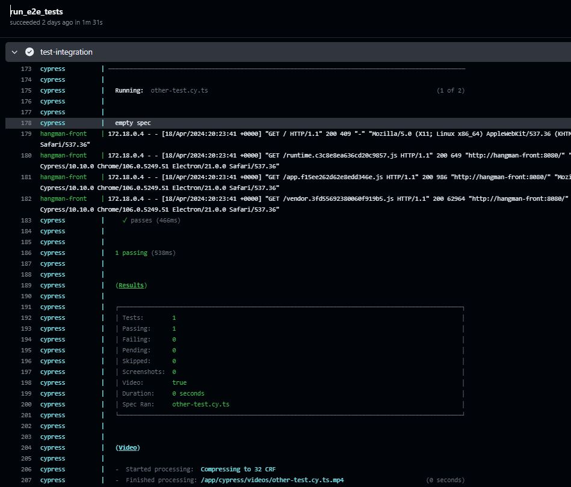

# Exercise 4. Running Cypress in Continuous Integration (CI) with Docker Compose - CHALLENGE
0. [Introduction](#intro)
1. [Create an entrypoint script to do some initial setup](#entrypoint)
2. [Dockerfile with Cypress](#dockerfile)
3. [Docker Compose to run in CI/CD Pipeline](#dockercompose)
4. [Workflow for running e2e tests using Docker Compose](#workflow)
5. [Run the workflow](#run)

<a name="intro"></a>
## 0. Introduction

To make sure that the execution of the Cypress test runner needs to fire after the web hangman-front service connects and run its server (or whenever the web hangman-front service connects server properly).

To achieve this, these are the steps I've followed:

1. Create an entrypoint script `docker-entrypoint.sh`

2. Create a Dockerfile for Cypress Tests

3. Create a `docker-compose.yml` to run in CI/CD Pipeline

4. Create the GitHub workflow

5. Run the workflow

<a name="entrypoint"></a>
## 1. Create an entrypoint script to do some initial setup
There's a pattern of using an entrypoint script to do some initial setup, and then use exec "$@" to run the container's command as the main process. This lets you use the `wait-for-it.sh` script to wait for the frontend to be up, then run whatever the main command happens to be. 

The `hangman-e2e\e2e\docker-entrypoint.sh` script looks like:
```powershell
#!/bin/sh

# Abort on any error (including if wait-for-it fails).
set -e

# Wait for the frontend to be up, if we know where it is.
if [ -n "$HANGMAN_FRONT_HOST" ]; then
  /app/wait-for-it.sh "$HANGMAN_FRONT_HOST:${HANGMAN_FRONT_PORT:-8080}"
fi

# Run the main container command.
exec "$@"
```

In the `hangman-front\docker-compose.yml` file the configuration is added to say that the frontend is `HANGMAN_FRONT_HOST`.

<a name="dockerfile"></a>
## 2. Dockerfile with Cypress
Below is the `hangman-e2e\e2e\Dockerfile` Dockerfile for running Cypress tests using the Cypress base image. 

```Dockerfile
# Use the Cypress base image
FROM cypress/base:16

# Set the working directory in the container
WORKDIR /app

# Copy the test code into the container
COPY ./package.json .
COPY ./package-lock.json .
COPY ./cypress.config.ts .
COPY ./tsconfig.json .
COPY ./cypress ./cypress

COPY ./wait-for-it.sh ./wait-for-it.sh
COPY ./docker-entrypoint.sh ./docker-entrypoint.sh

RUN chmod +x ./wait-for-it.sh ./docker-entrypoint.sh

ENV CI=1 

# Install Cypress and any other required npm packages
RUN npm ci

# It must use the JSON-array syntax
ENTRYPOINT ["./docker-entrypoint.sh"]
# Execute the Cypress test runner
CMD ["npx", "cypress", "run"]
```

The key points here are:
* We set a base image, specify the working directory, copy our project files into the container, install dependencies, and set the default command to run our tests.

* The `wait-for-it.sh` and `docker-entrypoint.sh` shell scripts are copied into workdir, and run as an executable. So, the scripts need to be built into the image, and its standard startup sequence needs to know to run it.

* The `docker-entrypoint.sh` script is executable, and it's the image's ENTRYPOINT.

* In Docker, containers continue to run as long as the "main app" is active. The term "main app" refers to the primary application or process that is executed when the container starts. It's defined either in the container's Dockerfile using the CMD or ENTRYPOINT instructions or at runtime with the docker run command.

<a name="dockercompose"></a>
## 3. Docker Compose to run in CI/CD Pipeline
When integrating into CI/CD pipelines, we can make use of Docker Compose to control multiple containers. 

Below is the `hangman-front\docker-compose.yml` for this full-stack hangman application with Cypress tests. 

```yml
version: '3.9'

networks:
  integration-tests:
    driver: bridge

services:
  hangman-front:
    image: binarylavender/hangman-front:latest
    container_name: hangman-front
    depends_on:
      - hangman-api
    ports:
      - "8080:8080"
    environment:
      API_URL: http://localhost:3001
    networks:
      - integration-tests

  hangman-api:
      image: binarylavender/hangman-api:latest
      container_name: hangman-api
      ports:
        - "3001:3000"
      networks:
        - integration-tests

  e2e:
    container_name: cypress
    depends_on:
      - hangman-front
    build:
      context: ../hangman-e2e/e2e
      dockerfile: Dockerfile
    environment:
      - HANGMAN_FRONT_HOST=hangman-front
      - CYPRESS_BASE_URL=http://hangman-front:8080
    #command:
    #  [
    #   "./wait-for-it.sh",
    #   "http://hangman-front:8080",
    #   "--strict",
    #   "--timeout=30",
    #   "--",
    #   "npx","cypress","run"
    #  ]
    networks:
      - integration-tests
```
The above example has tree services:
1. `hangman-api` service
2. `hangman-front`, which depends on the `hangman-api` service. You want to ensure that the `hangman-api` starts and can accept connections before your `hangman-front` Node.js application starts. 
3. `e2e`, that depends on `hangman-front`. You want to ensure that the `hangman-front` and `hangman-api` start and can accept connections before your `e2e` Cypress application starts.

These dependencies are specified using the `depends_on` option which is a valuable tool in Docker Compose for ensuring that services start-up in the correct order with dependiences in a healthy state.

However, it's important to remember that depends_on only controls the startup order and does not guarantee service readiness by default. It doesn't wait until the container is in ready state. It only waits until the dependent container is in 'running' state. To verify the availability of dependent services before starting services that rely on them, use additional tools or techniques such as
* health checks, or
* your own start shell script in the e2e Dockerfile ENTRYPOINT to wait until a depending container service starts.

The key points here are:
* The  configuration is added to say that the frontend is `HANGMAN_FRONT_HOST`.
* There is no need to override command.

<a name="workflow"></a>
## 4. Workflow for running e2e tests using Docker Compose

Below is the `4.e2e-hangman-front-docker-compose.yaml` workflow.

```yml
name: Exercise 4 - Run e2e tests using Docker Compose

on:
  workflow_dispatch:

jobs:
  run_e2e_tests:
    runs-on: ubuntu-latest

    steps:
      - name: Checkout the repo
        uses: actions/checkout@v4
      - name: Login to Docker Hub
        uses: docker/login-action@v3
        with:
          username: ${{ secrets.DOCKER_USER }}
          password: ${{ secrets.DOCKER_PASSWORD }}
      - name: test-integration
        working-directory: ./hangman-front
        run: |
          docker-compose up --abort-on-container-exit --exit-code-from e2e
```

`docker-compose up` SERVICE will automatically include SERVICE’s dependencies. In the above example, `docker compose up e2e` will also create and start `hangman-api` and `hangman-front`.

<a name="run"></a>
## 5. Run the workflow

Run manually the `Exercise 3 - Run e2e tests using Docker Compose`.






