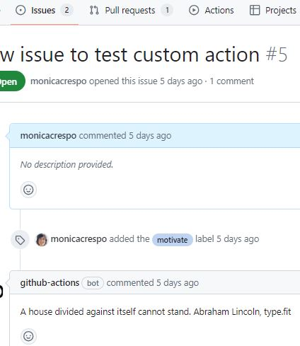

# Exercise 5. Custom JavaScript Action - NICE TO HAVE
0. [Introduction](#intro)
1. [Create an action metadata file](#actionMetadata)
2. [Add actions toolkit packages](#packages)
3. [Write the action code](#actionCode)
4. [Create a README](#readme)
5. [Commit, tag, and push your action to GitHub](#commit)
6. [Test out your action in a workflow](#test)

<a name="intro"></a>
## 0. Introduction

Before you begin, you'll need to download Node.js and create a public GitHub repository.

1. Download and install Node.js 20.x, which includes npm. https://nodejs.org/en/download/

2. Create a new public repository on GitHub.com, e.g. `bootcamp-devops-inspirational-quote-javascript-action`

3. Clone your repository to your computer. 

4. From your terminal, change directories into your new repository.
   `cd bootcamp-devops-inspirational-quote-javascript-action`

5. From your terminal, initialize the directory with npm to generate a `package.json` file by running the following command: `npm init -y`


To create a `Custom JavaScript Action` these are the steps I've followed:

1. Create an action metadata file.

2. Add actions toolkit packages.

3. Write the action code.

4. Create a README.

5. Commit, tag, and push your action to GitHub.

6. Test out your action in a workflow.

<a name="actionMetadata"></a>
## 1. Create an action metadata file

Create a new file named `action.yaml` in the bootcamp-devops-inspirational-quote-javascript-action directory with the following code. 

```yaml
name: 'Inspirational quote'
description: 'Get an inspirational quote'
outputs:
  quote: # id of output
    description: 'A random inspirational quote message'
runs:
  using: 'node20'
  main: 'dist/index.js'
```
This file defines the quote output. It also tells the action runner how to start running this JavaScript action.

<a name="packages"></a>
## 2. Add actions toolkit packages

The actions toolkit is a collection of Node.js packages that allow you to quickly build JavaScript actions with more consistency.

The toolkit @actions/core package provides an interface to the workflow commands, input and output variables, exit statuses, and debug messages.

The toolkit also offers a @actions/github package that returns an authenticated Octokit REST client and access to GitHub Actions contexts.

At your terminal, install the actions toolkit core and github packages.
```shell
npm install @actions/core
npm install @actions/github
```
Now you should see a node_modules directory with the modules you just installed and a package-lock.json file with the installed module dependencies and the versions of each installed module.

GitHub downloads each action run in a workflow during runtime and executes it as a complete package of code before you can use workflow commands like run to interact with the runner machine. This means you must include any package dependencies required to run the JavaScript code. You'll need to check in the toolkit core and github packages to your action's repository.

Checking in your node_modules directory can cause problems. As an alternative, you can use a tool called @vercel/ncc to compile your code and modules into one file used for distribution. Install vercel/ncc by running this command in your terminal. `npm i -g @vercel/ncc`

<a name="actionCode"></a>
## 3. Writing the action code

Add a new file called `index.js`, with the following code.

```JavaScript
const core = require('@actions/core');
const github = require('@actions/github');

// api for quotes
const url = 'https://type.fit/api/quotes';

try {
    // fetch the data from api
    fetch(url)
        // convert response to json
        .then((response) => response.json())
        // store it in data array
        .then((data) => {
            // generate a random number between 0 and the length of the data array
            const index = Math.floor(Math.random() * data.length);
            // store the quote present at the randomly generated index
            let quote = data[index].text;
            // check if the last char does not end with dot (.).   
            if(quote.slice(-1)!== '.'){
                // add a dot at the end of the quote 
                quote = quote.concat('.');
            }

            // store the author of the respective quote
            let author = data[index].author;        
            if(author==null)
            {
                author = "Anonymous";
            }

            // store the quote and the author
            let result = quote.concat(" ", author);            
            console.log(`${result}`);    
            core.setOutput('quote', result);
        })
        .catch((error) => {
            console.log(error);
            core.setFailed(error.message);
    });
    
    // Get the JSON webhook payload for the event that triggered the workflow
    const payload = JSON.stringify(github.context.payload, undefined, 2)
    console.log(`The event payload: ${payload}`);

} catch (error) {
    core.setFailed(error.message);
}
```
You can run the above code locally by running the following command:
```bash
$ node index.js
The event payload: {}
Be the chief but never the lord. Lao Tzu, type.fit

::set-output name=quote::Be the chief but never the lord. Lao Tzu, type.fit
```
<a name="readme"></a>
## 4. Create a README

To let people know how to use your action, this is the README.md file in your `bootcamp-devops-inspirational-quote-javascript-action` repository, that specifies the following information:

* A detailed description of what the action does.
* Required input and output arguments.
* An example of how to use your action in a workflow.

```Markdown
# Get inspirational quote javascript action

This action prints and returns a random quote and the author of the respective quote to the log.

## Inputs

This action does not use any input.

## Outputs

### `quote`

A random inspirational quote.

## Example usage
```yaml               
    uses: monicacrespo/bootcamp-devops-inspirational-quote-javascript-action@v1.0
```

<a name="commit"></a>
## 5. Commit, tag, and push your action to GitHub

First compile your code and modules into one file for distribution.
```
$ ncc build index.js
```

You'll see a new dist/index.js file with your code and the compiled modules.


Then, from your terminal, commit your action.yml, index.js, dist/index.js, node_modules, package.json, package-lock.json, .gitignore and README.md files.

It's best practice to also add a version tag for releases of your action. 

```
$ git add .
git commit -m "My first action is ready"
git tag -a -m "My first action release" v1.0
git push --follow-tags
```

On GitHub.com, navigate to the main page of the repository and [create a Release](https://docs.github.com/en/repositories/releasing-projects-on-github/managing-releases-in-a-repository#creating-a-release) with the tag `v1.0`. 


<a name="test"></a>
## 6. Test out your action in a workflow

The below workflow called `5.quote-custom-action.yaml` run the `monicacrespo/bootcamp-devops-inspirational-quote-javascript-action@v1.0` public action within an external repository.

```yaml
name: Exercise 5 - Quote Custom Action 
on:
  issues:
    types:
      - labeled
```
The `issues` event does have activity types that give you more control over when your workflow should run. Use on.<event_name>.types to define the type of event activity that will trigger a workflow run.

For example, the above workflow triggers when an issue is labeled. 

```yaml
jobs:
  add-comment:
    if: github.event.label.name == 'motivate'
    runs-on: ubuntu-latest
```
This workflow is triggered when the `motivate` label is added to an issue.

```yaml
    permissions:
      issues: write
```
You need to have write access to this repository to commenting on an issue when a label is added. 

```yaml
    steps:
      - name: Get quote using Custom Action
        id: quote
        uses: monicacrespo/bootcamp-devops-inspirational-quote-javascript-action@v1.0
``` 
The runner will download the `bootcamp-devops-inspirational-quote-javascript-action@v1.0` action from your public repository and then execute it to get an inspirational quote.

```yaml
      - name: Add comment in issue
        run: gh issue comment "$NUMBER" --body "$BODY"
        env:
          GH_TOKEN: ${{ secrets.GITHUB_TOKEN }}
          GH_REPO: ${{ github.repository }}
          NUMBER: ${{ github.event.issue.number }}
          BODY: ${{ steps.quote.outputs.quote }}
```
Every time an issue in this repository is labeled, this workflow will run. If the label that was added is `motivate`, the `gh issue comment` command will add the comment that you specified to the issue. That comment is the inspirational quote from the previous step.

To trigger the above workflow, follow these steps:

1. Open an issue in your repository. Label the issue with the `motivate` label.

2. View the history of your workflow runs, to see the workflow run triggered by labeling the issue.

   

3. When the workflow completes, check the logs, and see that the output of the JavaScript action is a quote, `A house divided against itself cannot stand. Abraham Lincoln, type.fit`. And that quote is being added to the issue.

   . 

4. Go to the issue that you labeled and it should have a comment added.

   
