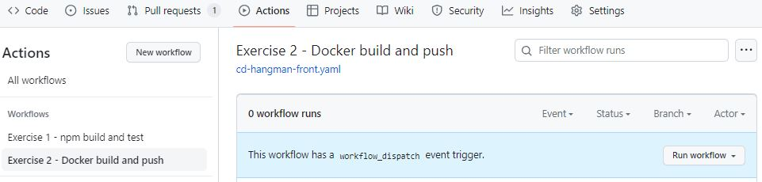

# CI/CD pipeline with GitHub Actions 
1. [Introduction](#intro)
2. [CI Workflow - MUST](#ci)
3. [CD Workflow - MUST](#cd)
4. [Tests e2e Workflow - NICE TO HAVE](#e2e)
5. [Custom JavaScript Action - NICE TO HAVE](#js)

<a name="intro"></a>
## 1. Introduction

You can automate, customize, and execute your software development workflows in your repository with GitHub Actions. You can discover, create, and share actions to perform any job you'd like, including CI/CD, and combine actions in a completely customized workflow.

A workflow must contain the following components:

1. One or more events that will [trigger the workflow](https://docs.github.com/en/actions/using-workflows/triggering-a-workflow).
2. One or more jobs, each of which will execute on a runner machine and run a series of one or more steps.
3. Each step can either run a script that you define or run an action, which is a reusable extension that can simplify your workflow.

GitHub Actions uses YAML syntax to define the workflow. Each workflow is stored as a separate YAML file in your code repository, in a directory named `.github\workflows`.

### Solution structure
```
├── .github (new) 
│   ├── workflows (new)
│     ├── cd-hangman-front.yaml (new)
│     ├── ci-hangman-front.yaml (new)
│     ├── hangman-e2e-integration.yaml (new)
├── hangman-api (existing)
│   ├── ...
│   ├── .env 
│   ├── Dockerfile 
│   ├── Dockerfile.migrations 
│   ├── package-lock.json 
│   ├── package.json 
├── hangman-e2e (existing)
│   ├── e2e
│       ├── .env 
│       ├── cypress-16.dockerfile 
│       ├── e2e.dockerfile
│       ├── package-lock.json 
│       ├── package.json 
├── hangman-front (existing)
│   ├── ...
│   ├── Dockerfile 
├── hangman-front-locally.md (new)
├── hangman-front-locally.JPG (new)
├── README.md (new)
```

<a name="ci"></a>
## 2. CI Workflow - MUST

We've been asked by LemonCode team to create a [CI workflow](https://github.com/Lemoncode/bootcamp-devops-lemoncode/tree/master/03-cd/exercises#1-crea-un-workflow-ci-para-el-proyecto-de-frontend---obligatorio) for the frontend project [.start-code/hangman-front](https://github.com/Lemoncode/bootcamp-devops-lemoncode/tree/master/03-cd/03-github-actions/.start-code/hangman-front). It’s a small NodeJS application that runs an Express server. You’ll need Node.js and Visual Studio code as prerequisites for the application.

The CI workflow needs to run when the following two events occur:
* There are changes on the hangman-front proyect   
* Pull request is made

The workflow will do the following tasks:

* Build the hangman-front project
* Run unit tests


### Workflow for automating the build and unit tests 

`.github\workflows\ci-hangman-front.yaml` 

```yaml
name: Exercise 1 - npm build and test

on:   
  pull_request:
    branches: [main]
    paths: ["hangman-front/**"]

jobs:
  build:
    runs-on: ubuntu-latest
   
    steps:
      - uses: actions/checkout@v4
      - uses: actions/setup-node@v4
        with:
          node-version: 16
      - name: build
        working-directory: ./hangman-front
        run: |
          npm ci
          npm run build --if-present
          npm test
```

The above workflow specifies two conditions to run:
* Changes on `hangman-front/**` path 
* Pull request targeting the `main` branch

It has one job named `build` and it does use the following actions:

* [checkout](https://github.com/actions/checkout) action will perform a local git clone of the repository.
* [setup-node](https://github.com/actions/setup-node) action will take care of installing Node.js inside the container running our job. We can see one of the action arguments here too. The with block tells Actions what Node.js version to install—in our case, the 16 version.
* The next step installs any Node.js modules we need. Then builds it. And then executes our tests using `npm test`

### Run the workflow
1. Create a new branch, e.g. 'ci-newworkflow' and switched to it.
```bash
$ git checkout -b ci-newworkflow
```

2. Make a change to our `hangman-front` project, e.g. edit the app.tsx file and add a comment, commit the result, and push it.

```bash
git add hangman-front/src/app.tsx
git commit -m 'Added a comment to trigger ci workflow'
git push origin ci-newworkflow
```

3. Create a pull request for this branch. After the request has been created, Actions will initiate our workflow, resulting in a failure run. The reason is because the `StartGame` unit test located on `hangman-front/src/components/start-game.spec.tsx` file, has an error. 

   GitHub Action runs displayed on the Actions tab 

   

   And logs within each step

   

   

4. Fix the unit test, and push it, resulting in a successful run.
   Before the fix
   ``` 
   expect(items).toHaveLength(1);
   ```
   After the fix
   ```
   expect(items).toHaveLength(2);
   ```
   

   

5. Merge it to the main branch.

<a name="cd"></a>
## 3. CD Workflow - MUST
We've been asked by LemonCode team to create a [CD workflow](https://github.com/Lemoncode/bootcamp-devops-lemoncode/tree/master/03-cd/exercises#2-crea-un-workflow-cd-para-el-proyecto-de-frontend---obligatorio) for the frontend project that is triggered manually using `workflow_dispatch` event.
The workflow will do the following tasks:

* Create a new Docker image 
* Publish that image in GitHub Container Registry

### Workflow for building Docker images 

#### workflow_dispatch
The `.github\workflows\cd-hangman-front.yaml` workflow uses the `workflow_dispatch` event that allows you to manually trigger a GitHub Action, without having to push or create a pull request.

```
name: Exercise 2 - Docker build and push
 
on:
  workflow_dispatch:
    inputs:
      working-directory:
        description: 'Working directory to build a Docker Image and Push to Docker Hub'       
        default: 'hangman-front'
        type: choice
        required: true
        options:
          - 'hangman-front'
          - 'hangman-api'
```

#### Environment Variable

```yaml
jobs:
  build_and_push_to_registry:
    name: Build and push Docker image to GitHub Packages
    runs-on: ubuntu-latest   
  
    steps:
      # date and time (remember ':' is not allowed in a tag) 20240304.215427
      - name: Get current date
        run: |
          echo "CURRENT_DATE=$(date +'%Y%m%d-%H%M')" >> $GITHUB_ENV
```

CURRENT_DATE. It will get the current date, using the `%Y%m%d-%H%M` format (e.g. `20240308-2213` for `08/03/2024 22:13`), store it in the GITHUB_ENV, and automatically makes it available to all subsequent actions in the current job. The currently running action cannot access the updated env variable. 
  
NOTE that `$(command)` is POSIX shell syntax for "run command and substitute its output". date is a standard Linux/Unix command, the +FORMAT syntax tells it in which format it should output the date. See also: [date manpage](https://manpages.debian.org/bullseye/coreutils/date.1.en.html).

#### Docker Metadata action

```yaml
- name: Docker meta
  id: meta
  uses: docker/metadata-action@v5
  with:
    images: ${{ secrets.DOCKER_USER }}/${{ inputs.working-directory }}
    tags: |
      type=raw,value=latest,enable={{is_default_branch}} 
      type=raw,value=${{ env.CURRENT_DATE }}
```

[docker/metadata-action@v5](https://github.com/docker/metadata-action) is used with `Docker Build Push` action to tag and label Docker images.
It will generate one or two tags for the resulting build. The action will also generate labels that will help Github associate the image with the source repository.

On the default branch, in this repository is `main`, it will tag with 
* `latest` by using
  * [custom tag type=raw](https://github.com/docker/metadata-action?tab=readme-ov-file#typeraw)
  * [{{is_default_branch}}](https://github.com/docker/metadata-action?tab=readme-ov-file#is_default_branch) returns true if the branch that triggered the workflow run is the default one, otherwise false.
* date, e.g. `20240308-2213` by using
  * [custom tag type=raw](https://github.com/docker/metadata-action?tab=readme-ov-file#typeraw)
  * CURRENT_DATE set up in the previous `Get current date` action.

Any other branches, it will tag with only the current date.


#### Set up Docker Buildx action

```yaml
- name: Set up Docker Buildx
  uses: docker/setup-buildx-action@v3
```
[setup-buildx](https://github.com/docker/setup-buildx-action) is a GitHub Action to create and boot a builder using by default the docker-container driver. This is not required but recommended using it to be able to build multi-platform images, export cache, etc.

#### Login to Docker Hub action 
```yaml
- name: Login to Docker Hub
  uses: docker/login-action@v3
  with:
    username: ${{ secrets.DOCKER_USER }}
    password: ${{ secrets.DOCKER_PASSWORD }}
 ```
[login](https://github.com/docker/login-action) action will take care to log in against the Docker registry.
We are using the `DOCKER_USER` and `DOCKER_PASSWORD` as `secrets` to provide credentials to log in to the DockerHub registry we want to store our Docker image. Both values are encrypted and open decrypted when being used during our workflow’s execution, so they are not exposed in the workflow file.

#### Build and push Docker Image
```
- name: Build and push Docker Image
  uses: docker/build-push-action@v5
  with:
    context: ./${{ inputs.working-directory }}
    file: ./${{ inputs.working-directory }}/Dockerfile
    push: true
    tags: ${{ env.DOCKER_USER }}/${{ inputs.working-directory }}:${{ env.CURRENT_DATE }}
  ```

[build-push](https://github.com/docker/build-push-action) action will build the new Docker image. If the build succeeds, will push the built image to Docker official Container registry (Docker Hub).

The build-push-action main options required for GitHub Packages are:
  * context: Defines the build's context as the set of files located in the specified path.
  * push: If set to true, the image will be pushed to the registry if it is built successfully.
  * tags generated in the "Docker meta" action, for example, `binarylavender/hangman-front:latest,binarylavender/hangman-front:20240309.0944`.

### Run the workflow
To run you workflow follow these steps:
1. Add the DOCKER_PASSWORD secret's value in our repository settings. For more information, see [Creating secrets for a repository](https://docs.github.com/en/actions/security-guides/using-secrets-in-github-actions#creating-secrets-for-a-repository).

2. Go to the Actions tab of your repository, click on the "Exercise 2 - Docker build and push" workflow, and then "Run workflow" button:




<a name="e2e"></a>
## 4. Tests e2e Workflow - NICE TO HAVE

We've been asked by LemonCode team to create a [e2e tests workflow](https://github.com/Lemoncode/bootcamp-devops-lemoncode/tree/master/03-cd/exercises#3-crea-un-workflow-que-ejecute-tests-e2e---opcional).

You can use [Docker Compose](https://docs.docker.com/compose/gettingstarted/) or [Cypress action](https://github.com/cypress-io/github-action) to run the tests located [here](https://github.com/Lemoncode/bootcamp-devops-lemoncode/tree/master/03-cd/03-github-actions/.start-code/hangman-e2e/e2e).

### Workflow for running e2e tests 
```yaml
name: Exercise 3 - Run e2e tests
 
on:
  workflow_dispatch:

jobs:
  run_e2e_tests:
    runs-on: ubuntu-latest

    steps:
      - name: Checkout the repo
        uses: actions/checkout@v4
      - name: Login to Docker Hub
        uses: docker/login-action@v3
        with:
          username: ${{ secrets.DOCKER_USER }}
          password: ${{ secrets.DOCKER_PASSWORD }}
      - name: Run Api service in background        
        run: |
          docker run -d -p 3001:3000 ${{ secrets.DOCKER_USER }}/hangman-api:latest           
      - name: Run Front service in background 
        run: |            
          docker run -d -p 8080:8080 -e API_URL=http://localhost:3001 ${{ secrets.DOCKER_USER }}/hangman-front:latest            
      - name: Run e2e tests
        uses: cypress-io/github-action@v6
        with:
          working-directory: ./hangman-e2e/e2e
```

### Run the workflow
We can use both our hangman-front and hangman-api together to run our end-to-end tests.
1. Build and push a Docker image of the hangman-api to Docker Hub registry. To do so, run manually the `Exercise 2 - Docker build and push` selecting hangman-api as a working directory.
2. Run manually the `Exercise 3 - Run e2e tests`.


<a name="js"></a>
## 5. Custom JavaScript Action - NICE TO HAVE
We've been asked by LemonCode team to create a [custom JavaScript Action](https://github.com/Lemoncode/bootcamp-devops-lemoncode/tree/master/03-cd/exercises#4-crea-una-custom-javascript-action---opcional) that runs when an issue contains the `motivate` label. The action will print by console a motivational message. You could use this free [API](https://type.fit/#%7B%22text%22:%22Welcome%20to%20Type.fit!%5CnA%20keyboard%20typing%20practice%20web%20application.%5CnDesigned%20for%20the%20improvement%20of%20typing%20speed%20along%20with%20accuracy.%22%7D). You can find more information of how to create a una custom JS action in this [link](https://docs.github.com/es/actions/creating-actions/creating-a-javascript-action).

`curl https://type.fit/api/quotes`