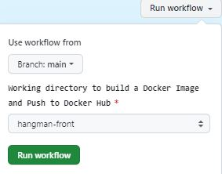

# CI/CD pipeline with GitHub Actions 
1. [Introduction](#intro)
2. [CI Workflow - MUST](#ci)
3. [CD Workflow - MUST](#cd)
4. [Tests e2e Workflow - NICE TO HAVE](#e2e)
5. [Custom JavaScript Action - NICE TO HAVE](#js)

<a name="intro"></a>
## 1. Introduction

You can automate, customize, and execute your software development workflows in your repository with GitHub Actions. You can discover, create, and share actions to perform any job you'd like, including CI/CD, and combine actions in a completely customized workflow.

A workflow must contain the following components:

1. One or more events that will [trigger the workflow](https://docs.github.com/en/actions/using-workflows/triggering-a-workflow).
2. One or more jobs, each of which will execute on a runner machine and run a series of one or more steps.
3. Each step can either run a script that you define or run an action, which is a reusable extension that can simplify your workflow.

GitHub Actions uses YAML syntax to define the workflow. Each workflow is stored as a separate YAML file in your code repository, in a directory named `.github\workflows`.

### Solution structure
```
├── .github (new) 
│   ├── workflows (new)
│     ├── cd-hangman-front.yaml (new)
│     ├── ci-hangman-front.yaml (new)
│     ├── e2e-hangman-front.yaml (new)
│     ├── e2e-hangman-front-v2.yaml (new)
│     ├── quote-custom-action.yaml (new)
├── hangman-api (existing)
│   ├── ...
│   ├── .env 
│   ├── Dockerfile 
│   ├── Dockerfile.migrations 
│   ├── package-lock.json 
│   ├── package.json 
├── hangman-e2e (existing)
│   ├── e2e
│       ├── .env 
│       ├── cypress-16.dockerfile 
│       ├── e2e.dockerfile
│       ├── Dockerfile (new)
│       ├── package-lock.json 
│       ├── package.json 
├── hangman-front (existing)
│   ├── ...
│   ├── docker-compose.yml (new) 
│   ├── Dockerfile 
├── hangman-front-locally.md (new)
├── hangman-front-locally.JPG (new)
├── README.md (new)
```

<a name="ci"></a>
## 2. CI Workflow - MUST

We've been asked by LemonCode team to create a [CI workflow](https://github.com/Lemoncode/bootcamp-devops-lemoncode/tree/master/03-cd/exercises#1-crea-un-workflow-ci-para-el-proyecto-de-frontend---obligatorio) for the frontend project [.start-code/hangman-front](https://github.com/Lemoncode/bootcamp-devops-lemoncode/tree/master/03-cd/03-github-actions/.start-code/hangman-front). It’s a small NodeJS application that runs an Express server. You’ll need Node.js and Visual Studio code as prerequisites for the application.

The CI workflow needs to run when the following two events occur:
* There are changes on the hangman-front proyect   
* Pull request is made

The workflow will do the following tasks:

* Build the hangman-front project
* Run unit tests


### Workflow for automating the build and unit tests 

`.github\workflows\ci-hangman-front.yaml` 

```yaml
name: Exercise 1 - npm build and test

on:   
  pull_request:
    branches: [main]
    paths: ["hangman-front/**"]

jobs:
  build:
    runs-on: ubuntu-latest
   
    steps:
      - uses: actions/checkout@v4
      - uses: actions/setup-node@v4
        with:
          node-version: 16
      - name: build
        working-directory: ./hangman-front
        run: |
          npm ci
          npm run build --if-present
          npm test
```

The above workflow specifies two conditions to run:
* Changes on `hangman-front/**` path 
* Pull request targeting the `main` branch

It has one job named `build` and it does use the following actions:

* [checkout](https://github.com/actions/checkout) action will perform a local git clone of the repository.
* [setup-node](https://github.com/actions/setup-node) action will take care of installing Node.js inside the container running our job. We can see one of the action arguments here too. The with block tells Actions what Node.js version to install—in our case, the 16 version.
* The next step installs any Node.js modules we need. Then builds it. And then executes our tests using `npm test`

### Run the workflow
1. Create a new branch, e.g. 'ci-newworkflow' and switched to it.
```bash
$ git checkout -b ci-newworkflow
```

2. Make a change to our `hangman-front` project, e.g. edit the app.tsx file and add a comment, commit the result, and push it.

```bash
git add hangman-front/src/app.tsx
git commit -m 'Added a comment to trigger ci workflow'
git push origin ci-newworkflow
```

3. Create a pull request for this branch. After the request has been created, Actions will initiate our workflow, resulting in a failure run. The reason is because the `StartGame` unit test located on `hangman-front/src/components/start-game.spec.tsx` file, has an error. 

   GitHub Action runs displayed on the Actions tab 

   

   And logs within each step

   

   

4. Fix the unit test, and push it, resulting in a successful run.
   Before the fix
   ``` 
   expect(items).toHaveLength(1);
   ```
   After the fix
   ```
   expect(items).toHaveLength(2);
   ```
   

   

5. Merge it to the main branch.

<a name="cd"></a>
## 3. CD Workflow - MUST
We've been asked by LemonCode team to create a [CD workflow](https://github.com/Lemoncode/bootcamp-devops-lemoncode/tree/master/03-cd/exercises#2-crea-un-workflow-cd-para-el-proyecto-de-frontend---obligatorio) for the frontend project that is triggered manually using `workflow_dispatch` event.
The workflow will do the following tasks:

* Create a new Docker image 
* Publish that image in GitHub Container Registry

### Workflow for building Docker images 

#### workflow_dispatch
The `.github\workflows\cd-hangman-front.yaml` workflow uses the `workflow_dispatch` event that allows you to manually trigger a GitHub Action, without having to push or create a pull request.
Then, it checks out the GitHub repository, uses the login-action twice to log in to both registries and generates tags and labels with the metadata-action action. Then the build-push-action action builds and pushes the Docker image to Docker Hub and the Container registry.

```yaml
name: Exercise 2 - Docker build and push

on:
  workflow_dispatch:
    inputs:
      working-directory:
        description: 'Working directory to build a Docker Image'
        default: 'hangman-front'
        type: choice
        required: true
        options:
          - 'hangman-front'
          - 'hangman-api'
```

#### Control permissions for GITHUB_TOKEN

```yaml
jobs:
  build_and_push_to_registries:
    name: Build and push Docker image to multiple registries
    runs-on: ubuntu-latest
    permissions:
      packages: write
      contents: read
```
GitHub Actions now lets you control the permissions granted to the GITHUB_TOKEN secret.

The GITHUB_TOKEN is an automatically generated secret that lets you make authenticated calls to the GitHub API in your workflow runs. Actions generates a new token for each job and expires the token when a job completes.

Sets the permissions granted to the GITHUB_TOKEN for the actions in this job.

* `packages: write` allows the job to ppload and publish packages to GitHub Packages.
* `contents: read` is sufficient for any workflows that simply need to clone and build.

#### Environment Variable

```yaml
    steps:
      # date and time (remember ':' is not allowed in a tag) 20240304.215427
      - name: Get current date
        run: |
          echo "CURRENT_DATE=$(date +'%Y%m%d-%H%M')" >> $GITHUB_ENV
```

CURRENT_DATE. It will get the current date, using the `%Y%m%d-%H%M` format (e.g. `20240308-2213` for `08/03/2024 22:13`), store it in the GITHUB_ENV, and automatically makes it available to all subsequent actions in the current job. The currently running action cannot access the updated env variable. 
  
NOTE that `$(command)` is POSIX shell syntax for "run command and substitute its output". date is a standard Linux/Unix command, the +FORMAT syntax tells it in which format it should output the date. See also: [date manpage](https://manpages.debian.org/bullseye/coreutils/date.1.en.html).

#### Set up Docker Buildx action

```yaml
- name: Set up Docker Buildx
  uses: docker/setup-buildx-action@v3
```
[setup-buildx](https://github.com/docker/setup-buildx-action) is a GitHub Action to create and boot a builder using by default the docker-container driver. This is not required but recommended using it to be able to build multi-platform images, export cache, etc.

#### Log in to Docker Hub action 
```yaml
- name: Login to Docker Hub
  uses: docker/login-action@v3
  with:
    username: ${{ secrets.DOCKER_USER }}
    password: ${{ secrets.DOCKER_PASSWORD }}
 ```
[login](https://github.com/docker/login-action) action will take care to log in against the Docker registry.
We are using the `DOCKER_USER` and `DOCKER_PASSWORD` as `secrets` to provide credentials to log in to the DockerHub registry we want to store our Docker image. Both values are encrypted and open decrypted when being used during our workflow’s execution, so they are not exposed in the workflow file.

#### Log in to Docker Hub action 

```yaml
name: Log in to the Container registry
        uses: docker/login-action@v3
        with:
          registry: ghcr.io
          username: ${{ github.actor }}
          password: ${{ secrets.GITHUB_TOKEN }}
```
Uses the docker/login-action action to log in to the Container registry registry using the account and password that will publish the packages. Once published, the packages are scoped to the account defined here.

#### Docker Metadata action

```yaml
- name: Extract metadata (tags, labels) for Docker
  id: meta
  uses: docker/metadata-action@v5
  with:
    # list of Docker images to use as base name for tags
    images: |
      ${{ secrets.DOCKER_USER }}/${{ inputs.working-directory }}
      ghcr.io/${{ github.repository_owner }}/${{ inputs.working-directory }}
    # generate Docker tags based on the following events/attributes
    tags: |
      type=raw,value=latest,enable={{is_default_branch}} 
      type=raw,value=${{ env.CURRENT_DATE }}
```

This step uses [docker/metadata-action@v5](https://github.com/docker/metadata-action) to extract tags and labels that will be applied to the specified image. The id "meta" allows the output of this step to be referenced in a subsequent step. The images value provides the base name for the tags and labels.

On the default branch, in this repository is `main`, the action will generate the following two tags: 
* `latest` by using
  * [custom tag type=raw](https://github.com/docker/metadata-action?tab=readme-ov-file#typeraw)
  * [{{is_default_branch}}](https://github.com/docker/metadata-action?tab=readme-ov-file#is_default_branch) returns true if the branch that triggered the workflow run is the default one, otherwise false.
* date, e.g. `20240308-2213` by using
  * [custom tag type=raw](https://github.com/docker/metadata-action?tab=readme-ov-file#typeraw)
  * CURRENT_DATE set up in the previous `Get current date` action.

Any other branches, it will generate only one tag with the current date.


#### Build and push Docker Image

```yaml
- name: Build and push Docker Images
  uses: docker/build-push-action@v5
  with:
    push: true
    context: ./${{ inputs.working-directory }}
    file: ./${{ inputs.working-directory }}/Dockerfile
    tags: ${{ steps.meta.outputs.tags }}
    labels: ${{ steps.meta.outputs.labels }}
  ```

This step uses the [build-push](https://github.com/docker/build-push-action) action to build the image, based on your repository's Dockerfile. If the build succeeds, it pushes the image to GitHub Packages and Docker official Container registry (Docker Hub). It uses the context parameter to define the build's context as the set of files located in the specified path. It uses the tags and labels parameters to tag and label the image with the output from the "meta" step.

The build-push-action main options required for GitHub Packages are:
  * context: Defines the build's context as the set of files located in the specified path.
  * push: If set to true, the image will be pushed to the registry if it is built successfully.
  * tags generated in the "Docker meta" action, for example, `binarylavender/hangman-front:latest,binarylavender/hangman-front:20240309.0944`.

### Run the workflow
To run you workflow follow these steps:
1. Add the DOCKER_PASSWORD secret's value in our repository settings. For more information, see [Creating secrets for a repository](https://docs.github.com/en/actions/security-guides/using-secrets-in-github-actions#creating-secrets-for-a-repository).

2. Go to the Actions tab of your repository, click on the "Exercise 2 - Docker build and push" workflow, and then "Run workflow" button:




<a name="e2e"></a>
## 4. Tests e2e Workflow - NICE TO HAVE

We've been asked by LemonCode team to create a [e2e tests workflow](https://github.com/Lemoncode/bootcamp-devops-lemoncode/tree/master/03-cd/exercises#3-crea-un-workflow-que-ejecute-tests-e2e---opcional).

You can use [Docker Compose](https://docs.docker.com/compose/gettingstarted/) or [Cypress action](https://github.com/cypress-io/github-action) to run the tests located [here](https://github.com/Lemoncode/bootcamp-devops-lemoncode/tree/master/03-cd/03-github-actions/.start-code/hangman-e2e/e2e).

### Workflow for running e2e tests 
```yaml
name: Exercise 3 - Run e2e tests
 
on:
  workflow_dispatch:

jobs:
  run_e2e_tests:
    runs-on: ubuntu-latest

    steps:
      - name: Checkout the repo
        uses: actions/checkout@v4
      - name: Login to Docker Hub
        uses: docker/login-action@v3
        with:
          username: ${{ secrets.DOCKER_USER }}
          password: ${{ secrets.DOCKER_PASSWORD }}
      - name: Run Api service in background        
        run: |
          docker run -d -p 3001:3000 ${{ secrets.DOCKER_USER }}/hangman-api:latest           
      - name: Run Front service in background 
        run: |            
          docker run -d -p 8080:8080 -e API_URL=http://localhost:3001 ${{ secrets.DOCKER_USER }}/hangman-front:latest           
      - name: Run e2e tests
        uses: cypress-io/github-action@v6
        with:
          working-directory: ./hangman-e2e/e2e
```
[cypress-io](https://github.com/cypress-io/github-action) action takes the project's npm package manager lock file, installs dependencies and caches these dependencies for future use. It then proceeds to run Cypress end-to-end tests with the built-in Electron browser and provides a test summary after completion.

### Run the workflow
We can use both our hangman-front and hangman-api together to run our end-to-end tests.
1. Build and push a Docker image of the hangman-api to Docker Hub registry. To do so, run manually the `Exercise 2 - Docker build and push` selecting hangman-api as a working directory.
2. Run manually the `Exercise 3 - Run e2e tests`.


<a name="js"></a>
## 5. Custom JavaScript Action - NICE TO HAVE
We've been asked by LemonCode team to create a [custom JavaScript Action](https://github.com/Lemoncode/bootcamp-devops-lemoncode/tree/master/03-cd/exercises#4-crea-una-custom-javascript-action---opcional) that runs when an issue contains the `motivate` label. The action will print by console a motivational message. You could use this free [API](https://type.fit/#%7B%22text%22:%22Welcome%20to%20Type.fit!%5CnA%20keyboard%20typing%20practice%20web%20application.%5CnDesigned%20for%20the%20improvement%20of%20typing%20speed%20along%20with%20accuracy.%22%7D). You can find more information of how to create a una custom JS action in this [link](https://docs.github.com/es/actions/creating-actions/creating-a-javascript-action).

`curl https://type.fit/api/quotes`

### Creating a JavaScript action
These are the steps I've followed to create a JavaScript action:
#### Prerequistes
1. Download and install Node.js 20.x, which includes npm. https://nodejs.org/en/download/

2. Create a new public repository on GitHub.com called `bootcamp-devops-inspirational-quote-javascript-action`

3. Clone your repository to your computer. 

4. From your terminal, change directories into your new repository.
   `cd bootcamp-devops-inspirational-quote-javascript-action`

5. From your terminal, initialize the directory with npm to generate a `package.json` file. `npm init -y`

#### Creating an action metadata file
Create a new file named `action.yaml` in the bootcamp-devops-inspirational-quote-javascript-action directory with the following code. 
```yaml
name: 'Inspirational quote'
description: 'Get an inspirational quote'
outputs:
  quote: # id of output
    description: 'A random inspirational quote message'
runs:
  using: 'node20'
  main: 'dist/index.js'
```
This file defines the quote output. It also tells the action runner how to start running this JavaScript action.

#### Adding actions toolkit packages
The actions toolkit is a collection of Node.js packages that allow you to quickly build JavaScript actions with more consistency.

The toolkit @actions/core package provides an interface to the workflow commands, input and output variables, exit statuses, and debug messages.

The toolkit also offers a @actions/github package that returns an authenticated Octokit REST client and access to GitHub Actions contexts.

At your terminal, install the actions toolkit core and github packages.
```shell
npm install @actions/core
npm install @actions/github
```
Now you should see a node_modules directory with the modules you just installed and a package-lock.json file with the installed module dependencies and the versions of each installed module.

GitHub downloads each action run in a workflow during runtime and executes it as a complete package of code before you can use workflow commands like run to interact with the runner machine. This means you must include any package dependencies required to run the JavaScript code. You'll need to check in the toolkit core and github packages to your action's repository.

Checking in your node_modules directory can cause problems. As an alternative, you can use a tool called @vercel/ncc to compile your code and modules into one file used for distribution. Install vercel/ncc by running this command in your terminal. `npm i -g @vercel/ncc`

#### Writing the action code
Add a new file called index.js, with the following code.
```JavaScript
const core = require('@actions/core');
const github = require('@actions/github');

// api for quotes
const url = 'https://type.fit/api/quotes';

try {
    // fetch the data from api
    fetch(url)
        // convert response to json
        .then((response) => response.json())
        // store it in data array
        .then((data) => {
            // generate a random number between 0 and the length of the data array
            const index = Math.floor(Math.random() * data.length);
            // store the quote present at the randomly generated index
            let quote = data[index].text;
            // check if the last char does not end with dot (.).   
            if(quote.slice(-1)!== '.'){
                // add a dot at the end of the quote 
                quote = quote.concat('.');
            }

            // store the author of the respective quote
            let author = data[index].author;        
            if(author==null)
            {
                author = "Anonymous";
            }

            // store the quote and the author
            let result = quote.concat(" ", author);            
            console.log(`${result}`);    
            core.setOutput('quote', result);
        })
        .catch((error) => {
            console.log(error);
            core.setFailed(error.message);
    });
    
    // Get the JSON webhook payload for the event that triggered the workflow
    const payload = JSON.stringify(github.context.payload, undefined, 2)
    console.log(`The event payload: ${payload}`);

} catch (error) {
    core.setFailed(error.message);
}
```
You can run the above code locally by running the following command:
```bash
$ node index.js
The event payload: {}
Be the chief but never the lord. Lao Tzu, type.fit

::set-output name=quote::Be the chief but never the lord. Lao Tzu, type.fit
```

#### Creating a README
To let people know how to use your action, you can create a README file. In your `bootcamp-devops-inspirational-quote-javascript-action` directory, create a README.md file that specifies the following information:

* A detailed description of what the action does.
* Required input and output arguments.
* An example of how to use your action in a workflow.

```Markdown
# Get inspirational quote javascript action

This action prints and returns a random quote and the author of the respective quote to the log.

## Inputs

This action does not use any input.

## Outputs

### `quote`

A random inspirational quote.

## Example usage
```yaml               
    uses: monicacrespo/bootcamp-devops-inspirational-quote-javascript-action@v1.0
```


#### Commit, tag, and push your action to GitHub

First compile your code and modules into one file for distribution.
```
$ ncc build index.js
```

You'll see a new dist/index.js file with your code and the compiled modules.


Then, from your terminal, commit your action.yml, index.js, dist/index.js, node_modules, package.json, package-lock.json, .gitignore and README.md files.

It's best practice to also add a version tag for releases of your action. 

```
$ git add .
git commit -m "My first action is ready"
git tag -a -m "My first action release" v1.0
git push --follow-tags
```

On GitHub.com, navigate to the main page of the repository and [create a Release](https://docs.github.com/en/repositories/releasing-projects-on-github/managing-releases-in-a-repository#creating-a-release) with the tag `v1.0`. 


### Testing out your public action in an workflow
The below workflow called `quote-custom-action.yaml` run the `monicacrespo/bootcamp-devops-inspirational-quote-javascript-action@v1.0` public action within an external repository.

```yaml
name: Quote Custom Action 
on:
  issues:
    types:
      - labeled
```
The `issues` event does have activity types that give you more control over when your workflow should run. Use on.<event_name>.types to define the type of event activity that will trigger a workflow run.

For example, the above workflow triggers when an issue is labeled. 

```yaml
jobs:
  add-comment:
    if: github.event.label.name == 'motivate'
    runs-on: ubuntu-latest
```
This workflow is triggered when the `motivate` label is added to an issue.

```yaml
    permissions:
      issues: write
```
You need to have write access to this repository to commenting on an issue when a label is added. 

```yaml
    steps:
      - name: Get quote using Custom Action
        id: quote
        uses: monicacrespo/bootcamp-devops-inspirational-quote-javascript-action@v1.0
``` 
The runner will download the `bootcamp-devops-inspirational-quote-javascript-action@v1.0` action from your public repository and then execute it to get an inspirational quote.

```yaml
      - name: Add comment in issue
        run: gh issue comment "$NUMBER" --body "$BODY"
        env:
          GH_TOKEN: ${{ secrets.GITHUB_TOKEN }}
          GH_REPO: ${{ github.repository }}
          NUMBER: ${{ github.event.issue.number }}
          BODY: ${{ steps.quote.outputs.quote }}
```
Every time an issue in this repository is labeled, this workflow will run. If the label that was added is `motivate`, the `gh issue comment` command will add the comment that you specified to the issue. That comment is the inspirational quote from the previous step.

#### Testing the workflow

1. Open an issue in your repository. Label the issue with the `motivate` label.

2. View the history of your workflow runs, to see the workflow run triggered by labeling the issue.

   

3. When the workflow completes, check the logs, and see that the output of the JavaScript action is a quote, `A house divided against itself cannot stand. Abraham Lincoln, type.fit`. And that quote is being added to the issue.

   . 

4. Go to the issue that you labeled and it should have a comment added.
   
