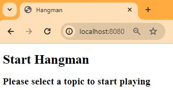

# Hangman run locally 
1. [Running locally hangman-front app and unit tests](#locally)
2. [Running locally e2e tests](#e2e)

<a name="locally"></a>
## 1. Running locally hangman-front app and unit tests

`hangman-front` app is a web app, implemented in NodeJS application that runs an Express server. You’ll need Node.js and Visual Studio code as prerequisites for the application.

Copied from [.start-code/hangman-front](https://github.com/Lemoncode/bootcamp-devops-lemoncode/tree/master/03-cd/03-github-actions/.start-code/hangman-front).

To build and run the tests manually of the `hangman-front` application do the following steps:

1. Clone the repository

    ```bash
    $ git clone https://github.com/monicacrespo/bootcamp-devops-student-github-actions.git
    $ cd hangman-front
    ```

2. Install the required Node.js modules
    ```bash
    $ npm install
    ```
3. Start the application

    ```bash
    $ npm start
    20:50:28 - Starting compilation in watch mode...
    [type-check:watch] 
    [start:dev       ] Failed to load ./.env.
    [type-check:watch] 
    [type-check:watch] 20:50:33 - Found 0 errors. Watching for file changes.
    [start:dev       ] <i> [webpack-dev-server] Project is running at:
    [start:dev       ] <i> [webpack-dev-server] Loopback: http://localhost:8080/, http://127.0.0.1:8080/
    [start:dev       ] <i> [webpack-dev-server] Content not from webpack is served from 'C:\_gitrepos\bootcamp-devops-student-github-actions\hangman-front\public' directory
    [start:dev       ] asset app.js 4.31 MiB [emitted] (name: app)
    [start:dev       ] asset index.html 314 bytes [emitted]
    [start:dev       ] runtime modules 28.4 KiB 14 modules
    [start:dev       ] modules by path ../node_modules/ 1.52 MiB 208 modules
    [start:dev       ] modules by path ./ 10.4 KiB
    [start:dev       ]   modules by path ./services/*.ts 3.33 KiB
    [start:dev       ]     ./services/index.ts 1.02 KiB [built] [code generated]
    [start:dev       ]     ./services/game.api.ts 1.25 KiB [built] [code generated]
    [start:dev       ]     ./services/config.ts 1.06 KiB [built] [code generated]
    [start:dev       ]   modules by path ./*.tsx 2.42 KiB
    [start:dev       ]     ./index.tsx 1.2 KiB [built] [code generated]
    [start:dev       ]     ./app.tsx 1.22 KiB [built] [code generated]
    [start:dev       ]   modules by path ./components/ 4.6 KiB
    [start:dev       ]     ./components/index.ts 1.03 KiB [built] [code generated]
    [start:dev       ]     ./components/start-game.component.tsx 3.57 KiB [built] [code generated]
    [start:dev       ] webpack 5.74.0 compiled successfully in 6187 ms
    ```

    It’ll run on localhost on port 8080, and we can browse to see its output

    

4. Run the unit test

    ```bash
    $ npm run test

    > hangman-front@1.0.0 test
    > jest -c ./config/test/jest.js

    PASS  src/components/start-game.spec.tsx (5.924 s)
    StartGame component specs
        √ should display a list of topics (197 ms)

    Test Suites: 1 passed, 1 total
    Tests:       1 passed, 1 total
    Snapshots:   0 total
    ```

<a name="e2e"></a>
## 2. Running locally e2e tests

The `hangman-e2e` project does use Cypress to test the full end-to-end flow of the hangman-front web app connected to the hangman-api.

Copied from [.start-code/hangman-e2e](https://github.com/Lemoncode/bootcamp-devops-lemoncode/tree/master/03-cd/03-github-actions/.start-code/hangman-e2e).


The `hangman-api` project is the back-end API with data persistence done through a postgress database.

Copied from [.start-code/hangman-api](https://github.com/Lemoncode/bootcamp-devops-lemoncode/tree/master/03-cd/03-github-actions/.start-code/hangman-api).

To run the e2e tests follow these steps:

1. The front and the api must be up by running the following commands:
   
    ```
    docker run -d -p 3001:3000 binarylavender/hangman-api:latest
    docker run -d -p 8080:8080 -e API_URL=http://localhost:3001 binarylavender/hangman-front:latest
    ```
2. To run the end to end tests run the following commands:
    ```
    $ cd hangman-e2e/e2e
    $ npm run open
    > @pumpbit-quiz-maker/e2e@1.0.0 open
    > cypress open
    
    
    Missing baseUrl in compilerOptions. tsconfig-paths will be skipped
    ```